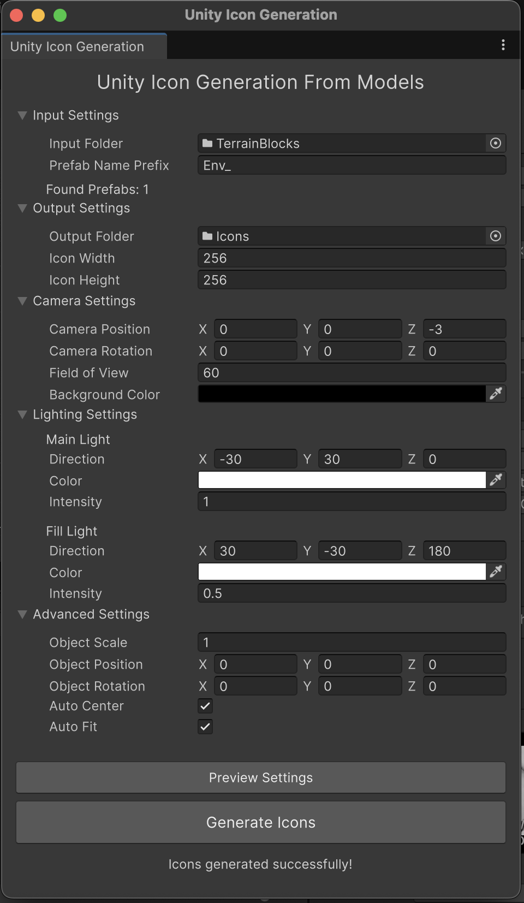

# Unity Icon Generation From Models

> *The creation of this tool was performed with support from various AI tools.*

A Unity Editor tool for generating transparent icons from 3D model prefabs with customizable rendering environments, featuring visual scene mockups, real-time preview capabilities, and professional lighting presets.



## Features

- **Multiple Export Formats**: Generate icons in PNG or TGA format
- **Size Variants**: Create multiple icon sizes simultaneously (16x16 to 4096x4096)
- **Professional Lighting Presets**: Built-in presets (Studio, Dramatic, Soft, Product Shot, Cinematic, Technical)
- **Complete Configuration Management**: Save and load entire tool configurations as reusable presets
- **Batch Processing**: Generate icons for multiple prefabs at once
- **Visual Scene Mockup**: Create and adjust lighting setups directly in the scene view
- **Real-time Preview**: Capture and preview icons before batch generation
- **Advanced Lighting System**: Main light + fill light + unlimited point lights with individual controls
- **Customizable Rendering**: Configure camera angle, lighting, and object positioning
- **Transparent Backgrounds**: Generates PNG/TGA icons with transparency
- **Auto-fit and Auto-center**: Automatically position and scale objects for optimal framing
- **Scene Management**: Preserves your current scene and handles unsaved changes intelligently
- **Unity 6 Compatible**: Built with Unity's UI Toolkit for modern editor integration
- **Persistent Settings**: Remembers your configuration between sessions

## Installation

### Via Git URL (Recommended)

1. Open Unity Package Manager (`Window > Package Manager`)
2. Click the `+` button and select "Add package from git URL"
3. Enter: `https://github.com/razluta/UnityIconGenerationFromModels.git`
4. Click "Add"

### Manual Installation

1. Download or clone this repository
2. Copy the entire folder to your project's `Packages` directory
3. Unity will automatically detect and import the package

## Usage

### Opening the Tool

1. Go to `Tools > Razluta > Unity Icon Generation From Models` in the Unity menu bar
2. The Unity Icon Generation window will open

### Quick Start Workflow

1. **Basic Setup**:
   - Select your prefabs folder (e.g., `Assets/Prefabs`)
   - Enter the prefix your prefabs start with (e.g., `Item_`)
   - Select or create an output folder for generated icons

2. **Configure Output**:
   - **Icon Size**: Choose main size from dropdown (16x16 to 4096x4096, default 512x512)
   - **Export Format**: Select PNG or TGA format
   - **Additional Sizes**: Optionally add more size variants for complete icon sets

3. **Choose Lighting Style**:
   - **Quick Start**: Select a lighting preset from the dropdown (Studio, Dramatic, etc.)
   - **Custom Setup**: Manually configure main light, fill light, and point lights
   - **Professional Workflow**: Use scene mockup for visual adjustment

3. **Visual Configuration** (Optional but Recommended):
   - Click **"Setup Scene Mockup"** to create a visual preview in your scene
   - Manually adjust camera position, lighting, and settings using Unity's normal tools
   - Click **"Capture Preview"** to see exactly what your icon will look like
   - Click **"Collect Scene Configuration"** to save your adjustments back to the tool

4. **Save Your Setup** (Optional):
   - Click **"Save Configuration"** to save your entire setup as a reusable preset
   - Perfect for different object types (weapons, armor, consumables, etc.)

5. **Generate Icons**:
   - Click **"Generate Icons"** to batch process all matching prefabs
   - Your original scene will be preserved and restored automatically

### Advanced Configuration

#### Camera Settings
- **Position**: Where the camera is positioned relative to the object
- **Rotation**: Camera angle (Euler angles)
- **Field of View**: Camera FOV in degrees
- **Background Color**: Usually set to transparent (alpha = 0)

#### Lighting System

##### Professional Lighting Presets
Choose from built-in lighting configurations optimized for different scenarios:

- **Studio**: Balanced professional lighting with warm key and cool fill
- **Dramatic**: High contrast with strong shadows and cinematic feel
- **Soft**: Even, diffused lighting perfect for delicate objects
- **Product Shot**: Clean, minimal shadows with 360° coverage
- **Cinematic**: Moody atmospheric lighting with warm/cool contrast
- **Technical**: Flat, even documentation lighting for technical drawings
- **Custom**: Your own manual lighting configuration

##### Advanced Lighting Controls
- **Main Light**: Primary directional light (key light)
- **Fill Light**: Secondary directional light to reduce harsh shadows
- **Point Lights**: Add unlimited point lights for accent lighting, rim lighting, etc.
   - Each point light has position, color, intensity, range, and enabled settings
   - Use "Add Point Light" button to create new lights
   - Individual remove buttons for each light
- **Smart Preset Detection**: Automatically switches to "Custom" when you manually adjust any lighting

#### Complete Configuration Management
- **Save Configuration**: Export your entire tool setup (lighting, camera, all settings) as a JSON file
- **Load Configuration**: Import previously saved configurations
- **Team Sharing**: Share configuration files with team members for consistent results
- **Project-Specific Setups**: Create different configurations for different asset types

#### Output Settings
- **Icon Size**: Single dropdown with power-of-2 sizes from 16x16 to 4096x4096
- **Export Format**: Choose between PNG (recommended) or TGA format
- **Size Variants**: Generate multiple sizes simultaneously for complete icon sets
   - Main size gets clean filename: `Sword_Icon.png`
   - Additional sizes get size suffix: `Sword_Icon_256x256.png`
- **Smart Workflow**: Add/remove additional sizes with simple UI controls
#### Advanced Object Settings
- **Object Scale**: Global scale multiplier for all objects
- **Object Position/Rotation**: Override positioning for all objects
- **Auto Center**: Automatically center objects in view
- **Auto Fit**: Automatically scale objects to fit nicely in frame

#### Scene Management
- **Smart Scene Handling**: Automatically detects unsaved changes
- **Save Prompts**: Asks user to save before proceeding (optional)
- **Scene Restoration**: Returns to original scene after processing
- **Temporary Scene Creation**: All rendering happens in isolated temporary scenes

## Preview & Configuration Tools

### Professional Lighting Presets
Select from professionally designed lighting setups:
- **Quick Selection**: Choose from dropdown in Lighting Settings
- **Instant Application**: All lights (main, fill, point) automatically configured
- **Smart Detection**: Tool automatically switches to "Custom" when you manually adjust lighting
- **Optimized for Different Needs**: Each preset designed for specific object types and styles

### Setup Scene Mockup
Creates a complete visual mockup of your icon generation setup in the current scene:
- Camera positioned with your exact settings
- All lights (main, fill, point) created and positioned
- Objects organized under "IconGen_MockupRoot" for easy management
- Allows manual fine-tuning using Unity's familiar scene tools

### Capture Preview
Takes a snapshot using your current configuration:
- Renders at exact icon dimensions
- Shows preview in dedicated window with save option
- Perfect for testing before batch generation
- Instant visual feedback on lighting and positioning

### Collect Scene Configuration
Reads your manual adjustments back into the tool:
- Automatically detects all mockup objects in scene
- Updates UI with collected settings
- Saves configuration for future use
- Enables iterative refinement workflow

### Multiple Export Formats
Generate icons in your preferred format:
- **PNG Format**: Lossless compression, excellent for UI and web use
- **TGA Format**: Uncompressed, perfect for game engines and professional pipelines
- **Transparency Support**: Both formats maintain alpha channel for transparent backgrounds

### Size Variants System
Create complete icon sets with multiple sizes:
- **Power-of-2 Sizes**: From 16x16 to 4096x4096 pixels
- **Professional Standards**: Default 512x512 with common variants (64x64, 128x128, 256x256, 1024x1024)
- **Batch Generation**: All sizes generated simultaneously for each prefab
- **Smart Naming**: Main size gets clean name, variants include size suffix
- **Easy Management**: Add/remove additional sizes with simple UI controls
### Configuration Management
Save and load complete tool configurations:
- **Export Setup**: Save entire configuration as JSON file
- **Import Setup**: Load previously saved configurations
- **Team Collaboration**: Share configuration files with team members
- **Project Organization**: Create different setups for different asset types

## File Structure

```
com.razluta.unity-icon-generation-from-models/
├── package.json                                    # Package manifest
├── README.md                                       # This file
├── CHANGELOG.md                                    # Version history
├── Runtime/
│   └── UnityIconGenerationFromModels.Runtime.asmdef # Runtime assembly definition
├── Editor/
│   ├── UnityIconGenerationFromModels.Editor.asmdef  # Editor assembly definition
│   ├── Scripts/
│   │   ├── UnityIconGenerationWindow.cs             # Main UI window
│   │   ├── UnityIconGenerationTool.cs               # Core generation logic
│   │   ├── SceneMockupTool.cs                       # Scene mockup and preview system
│   │   ├── LightingPresets.cs                       # Professional lighting presets
│   │   ├── ConfigurationPresets.cs                  # Configuration save/load system
│   │   └── IconGeneratorSettings.cs                 # Settings management
│   └── Resources/
│       └── IconGeneratorWindow.uxml                 # UI layout definition
└── Samples/
    ├── ExamplePrefabs/                              # Sample prefabs for testing
    └── SampleUi.png                                 # Tool interface screenshot
```

## Technical Details

### Rendering Process

1. **Scene Management**: Preserves current scene and handles unsaved changes
2. **Temporary Scene Creation**: Creates isolated scene with configured lighting and camera
3. **Individual Processing**: Instantiates each prefab individually
4. **Auto-adjustment**: Applies auto-centering and auto-fitting if enabled
5. **High-Quality Rendering**: Renders to RenderTexture with transparency support and 8x MSAA
6. **PNG Export**: Converts to PNG and saves to output directory
7. **Cleanup & Restoration**: Cleans up temporary objects and restores original scene

### Advanced Lighting System

- **Main Directional Light**: Primary key lighting
- **Fill Directional Light**: Secondary shadow fill lighting
- **Unlimited Point Lights**: Dynamic point light system with individual controls
- **Real-time Mockup**: Visual scene representation for manual adjustment
- **Configuration Round-trip**: UI → Scene → Manual Adjustment → UI → Generation

### Performance Considerations

- Uses anti-aliasing (8x MSAA) for high-quality results
- Processes prefabs one at a time to avoid memory issues
- Cleans up resources after each render
- Shows progress bar during batch processing
- Temporary scene isolation prevents interference with main project

## Troubleshooting

### Common Issues

**"No prefabs found" message**
- Check that your input folder path is correct
- Verify your prefab name prefix matches your actual prefab names
- Make sure prefabs are actually in the specified folder (not subfolders)

**"Generate Icons" button disabled**
- Ensure input folder is selected and valid
- Verify output folder is selected
- Check that prefab name prefix is not empty
- Look at Console for debug messages

**Icons generated in wrong format**
- Check Export Format dropdown in Output Settings
- PNG recommended for most use cases
- TGA for professional/engine pipelines

**Missing size variants**
- Verify additional sizes are added in Output Settings
- Check output folder for files with size suffixes
- Ensure sufficient disk space for multiple large files

**Black icons instead of transparent**
- Ensure background color alpha is set to 0
- Check that your materials support transparency
- Verify render texture format supports alpha channel

**Scene mockup not working**
- Ensure you have an active scene open
- Check Console for error messages
- Try closing and reopening the tool window

**Objects appear too small/large**
- Enable "Auto Fit" for automatic scaling
- Adjust "Object Scale" manually
- Use scene mockup to visually adjust camera position/FOV
- Modify point light positions for better illumination

**Poor lighting/shadows**
- Use "Setup Scene Mockup" to visually adjust lighting
- Add point lights for accent lighting
- Adjust main light and fill light directions and intensities
- Use "Capture Preview" to test lighting before batch generation

### Performance Tips

- Process prefabs in smaller batches if you have memory constraints
- Close other Unity windows during generation to free up resources
- Use lower icon resolutions (128x128) for faster processing during testing
- Use scene mockup and preview to perfect settings before batch processing

### Workflow Tips

**Lighting & Visual Setup:**
- **Start with lighting presets** - Choose Studio, Dramatic, or Product Shot for instant professional results
- **Use scene mockup extensively** to get visual feedback on your setup
- **Use capture preview extensively** to test different lighting configurations
- **Iterate quickly** with the preset → mockup → preview → adjust cycle
- **Combine presets with manual adjustments** - Start with a preset, then fine-tune manually

**Output & Format Management:**
- **Start with size planning** - Choose main size and variants based on your target platforms
- **Use PNG for most projects** - Better compression and wider compatibility
- **Consider TGA for game engines** - Uncompressed format preferred by many engines
- **Generate complete icon sets** - Add common variants (64x64, 128x128, 256x256, 512x512, 1024x1024)
- **Test file sizes** - Large variants (2048x2048+) create substantial files
- **Organize output by format** - Consider separate folders for PNG vs TGA exports

**Project Organization:**
- **Save configurations for different asset types** - Create "WeaponIcons.json", "ArmorIcons.json", etc.
- **Share configurations with your team** for consistent visual style across projects
- **Test with one prefab first** before running full batch generation

## Version History

See [CHANGELOG.md](CHANGELOG.md) for detailed version history.

## Support

For issues, feature requests, or contributions, please visit the [GitHub repository](https://github.com/razluta/UnityIconGenerationFromModels).

## License

This tool is provided as-is for educational and commercial use. See the repository for specific license terms.